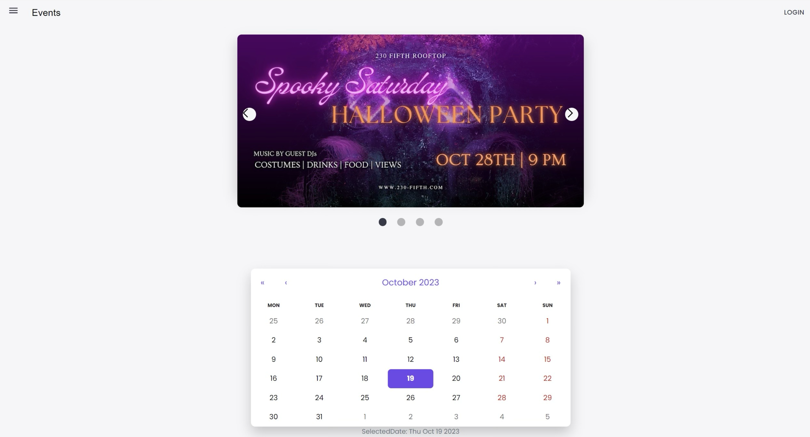
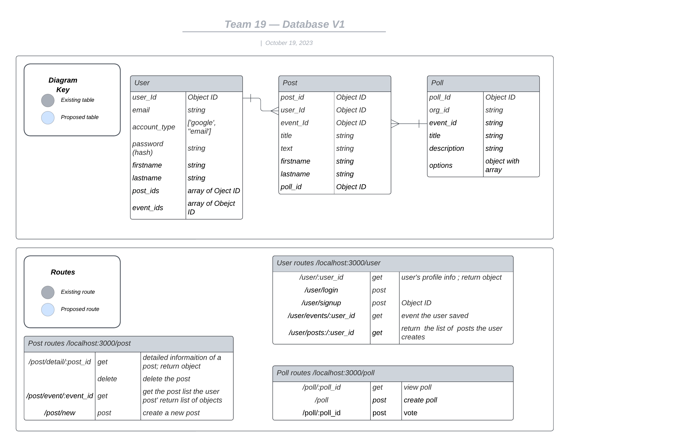

# CS555A-Team19-Project

This is CS555 Project Repo

<a name="readme-top"></a>

<br />
<div align="center">
  <a href="">
    
  </a>

  <h3 align="center">This is CS555 Project Repo</h3>

  <p align="center">
    Allowing User to Choose Favoriate Events with Integrating Eventbrite API
    <br />
  </p>
</div>

<!-- TABLE OF CONTENTS -->
<details>
  <summary>Table of Contents</summary>
  <ol>
    <li><a href="#members">Members</li>
    <li>
      <a href="#about-the-project">About The Project</a>
      <ul>
        <li><a href="#built-with">Built With</a></li>
      </ul>
    </li>
    <li>
      <a href="#getting-started">Getting Started</a>
      <ul>
        <li><a href="#prerequisites">Prerequisites</a></li>
        <li><a href="#installation">Installation</a></li>
      </ul>
    </li>
    <li><a href="#usage">Usage</a></li>
    <li><a href="#database">Database</a></li>
    <li><a href="#contact">Contact</a></li>
    <li><a href="#reference">Reference</a></li>
  </ol>
</details>

<!-- Members -->

## Members

<div align="left">
Yetong Chen <br/>Cong Guo<br/>Jiayin Huang<br/>Tzu-Ming Lu<br/>Chia Hsiang Wu<br/>Chongyuan Zhang<br/> Xu Zhou
</div>

<p align="right">(<a href="#readme-top">back to top</a>)</p>

<!-- ABOUT THE PROJECT -->

## About The Project

<div align="center">
<!--  -->
</div>
The objective of this project is to incorporate the Eventbrite API into the development of a web page that enables users to vote on events and provide comments.

<p align="right">(<a href="#readme-top">back to top</a>)</p>

### Built With

To develop this project, you will need the following tools:

- [![JavaScript][JavaScript-img]][JavaScript-url]
- [![Express.js][Express.js-img]][Express.js-url]
- [![node.js][node.js-img]][node.js-url]
- [![postman][postman-img]][postman-url]
- [![mongodb][mongodb-img]][mongodb-url]
- [![react][react-img]][react-url]
<!-- - [![mongodb][mongodb-img]][mongodb-url]
- [Google Authenticator](https://play.google.com/store/apps/details?id=com.google.android.apps.authenticator2&hl=en_US)
- [Mircosoft Authenticator](https://play.google.com/store/apps/details?id=com.azure.authenticator&hl=en_US) -->

<p align="right">(<a href="#readme-top">back to top</a>)</p>

## Getting Started

This is an example of how you may give instructions on setting up your project locally.
To get a local copy up and running follow these simple example steps.

### How to start the project:

1 - Install docker:  https://www.docker.com/get-started/

2 - Make sure the following ports are not occupied: `27017`(MongoDB service), `4000` (backend service), `3000` (frontend service)

3 - Execute the following terminal command in the project root directory: 

```bash
docker-compose build
docker-compose up
```

  This command will build each service's image in docker, including data seeding process.
   
  You might have to wait a while for everything to be set up in docker. 
    
  Then, you can open http://localhost:3000 on browser to start your testing.

4 - Make sure the services are started correctly in docker, enjoy！

<!--
### Prerequisites

1. Open your terminal, enter the command below, and choose a folder in which to clone the repository.
   ```sh
   git clone https://github.com/yetongchen/CS555A-Team19-Project.git
   ```
2. Install MongoDB

3. Open two terminals: one for hosting the data service and the other for hosting the React service.

### Run data service

1. Go to the data-service directory
    ```sh
      cd data-service
    ```
2. Run below code in terminal to install NPM packages
    ```sh
      npm install
    ```
3. Run below code in terminal
    ```sh
      npm start
    ```
4. Run below code in terminal
    ```sh
      pip install -r requirements.txt
    ```
<p align="right">(<a href="#readme-top">back to top</a>)</p>

### Run react service

1. Go to the data-service directory
    ```sh
      cd react-service
    ```
2. Run below code in terminal to install NPM packages
    ```sh
      npm install
    ```
3. Run below code in terminal
    ```sh
      npm start
    ```
<p align="right">(<a href="#readme-top">back to top</a>)</p>

-->
<!-- USAGE EXAMPLES -->


<!-- Mastering this application becomes achievable by following the steps outlined below

1. Prepare two email addresses: one for the sender and another for the receiver. Create an .env file in the root directory. In this file, you need to include GMAIL_USER (your sender email address) and GMAIL_PASS (16-digit password) for this email address. You can follow this [reference](https://israynotarray.com/nodejs/20230722/1626712457/) to generate a new 16-digit password.

2. Run npm start in terminal

   ```sh
   npm run start
   ```

3. Open Mongodb and postman. And type in user information in the postman to register a new user. (Note: If you enter a non-existent email, you will not be able to receive the email.)
 <div align="center">
  
</div>

4. Verify if MongoDB stores your data. (Note: You can download MongoDB Compass to visualize the database.)
 <div align="center">
  
</div>
5. After completing the aforementioned steps, the recipient's email will receive a message containing a QR code. Using a mobile phone, you can download either Google Authenticator or Microsoft Authenticator to scan the code. The application will then generate a token every 30 seconds. Users are required to input this token in the login interface to access their accounts.
<div></div>
6. Open Postman and send a request to test the validity of the token.
 <div align="center">
  
</div>

 -->

<!-- Database -->

## Database

<div align="center">
  <a href="">
    
  </a>
</div>

<!-- CONTACT -->

## Contact

<p align="right">(<a href="#readme-top">back to top</a>)</p>

## Reference

- [Node.js + MongoDB: User Authentication & Authorization with JWT](https://www.bezkoder.com/node-js-mongodb-auth-jwt/)

<p align="right">(<a href="#readme-top">back to top</a>)</p>

<!-- MARKDOWN LINKS & IMAGES -->

[JavaScript-url]: https://developer.mozilla.org/en-US/docs/Web/JavaScript
[JavaScript-img]: https://img.shields.io/badge/logo-javascript-blue?logo=javascript
[Express.js-url]: https://expressjs.com/
[Express.js-img]: https://img.shields.io/badge/Express.js-404D59?style=for-the-badge
[node.js-url]: https://nodejs.org/en
[node.js-img]: https://img.shields.io/badge/Node.js-43853D?style=for-the-badge&logo=node.js&logoColor=white
[postman-url]: https://www.postman.com/
[postman-img]: https://img.shields.io/badge/Postman-FF6C37?style=for-the-badge&logo=postman&logoColor=white
[mongodb-url]: https://www.mongodb.com/zh-cn
[mongodb-img]: https://img.shields.io/badge/MongoDB-%234ea94b.svg?style=for-the-badge&logo=mongodb&logoColor=white
[react-url]: https://react.dev/
[react-img]: https://img.shields.io/badge/react-%2320232a.svg?style=for-the-badge&logo=react&logoColor=%2361DAFB
